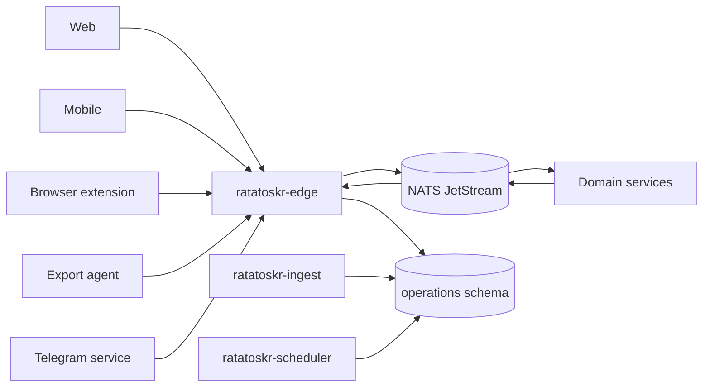
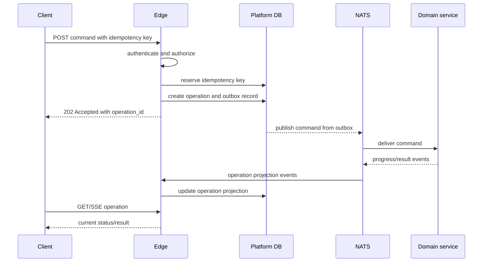

# Ratatoskr Platform Architecture

> Status: target architecture. Milestones 1 through 10 are implemented. Statements explicitly
> marked as future work remain target boundaries rather than claims about current behavior.

## 1. Purpose

`ratatoskr-platform` is the public control plane for Ratatoskr. It accepts user and device requests, authenticates actors, creates durable operations, normalizes generic ingress, schedules periodic commands, and exposes stable public API projections.

The repository contains three closely related deployables:

- `ratatoskr-edge` — public HTTP API, authentication, capabilities, operations, and progress delivery;
- `ratatoskr-ingest` — generic ingress normalization for non-provider-specific sources;
- `ratatoskr-scheduler` — periodic command publication without embedded domain logic.

Platform does not execute scraping, Git backup, LLM analysis, social synchronization, Telegram dialogue handling, or AI archive parsing.

## 2. Architectural position



Public clients communicate only with Edge. Provider-specific services own provider credentials and upstream semantics.

## 3. Repository structure

```text
ratatoskr-platform/
├── crates/
│   ├── api-doc/
│   ├── core/
│   ├── eventing/
│   ├── http/
│   ├── idempotency/
│   ├── identity/
│   ├── ingest/
│   ├── operations/
│   ├── persistence/
│   ├── public-api/
│   ├── scheduling/
│   └── telemetry/
├── services/
│   ├── edge/
│   ├── ingest/
│   └── scheduler/
├── deploy/
├── openapi/
├── schema.sql
└── docs/
```

This is the implemented repository structure. Tests remain next to their owning crate or service;
cross-cutting deployment artifacts live under `deploy/`, and `openapi/openapi.json` is generated from
the route tables and checked for drift.

Service binaries may share platform primitives, but they must not become one universal worker with all domain dependencies.

## 4. Bounded context

### 4.1. Owned data

Platform owns:

- internal user identity;
- registered devices and sessions;
- public authentication state;
- authorization grants and role projections;
- operation records and progress history;
- API idempotency records;
- generic ingress receipts;
- capability projection;
- audit context for public actions;
- transactional outbox/inbox for Platform-owned events.

Recommended schemas:

```text
identity.*
operations.*
platform_ingest.*
```

### 4.2. Data not owned

Platform does not own:

- extracted documents;
- summaries or embeddings;
- GitHub repositories, stars, or tokens;
- Git mirrors and snapshots;
- X, Instagram, Threads, OpenAI, Anthropic, or Telegram credentials;
- provider-specific synchronization checkpoints;
- domain-service tables.

Cross-schema writes and shared ORM entities are prohibited.

## 5. Edge architecture

### 5.1. Request pipeline



The API acknowledges durable acceptance, not completion.

### 5.2. HTTP layers

A request passes through:

1. request ID and trace context;
2. transport limits and timeouts;
3. authentication;
4. authorization;
5. CSRF/origin checks where applicable;
6. idempotency reservation;
7. payload validation;
8. application command handler;
9. transactional operation/outbox write;
10. response mapping and audit record.

Business handlers receive validated actor, tenant, and request context. They never parse credentials directly from headers.

### 5.3. Public API principles

- versioned `/v1` resource-oriented routes;
- OpenAPI as the public client contract;
- `Idempotency-Key` on retriable mutations;
- `202 Accepted` for asynchronous work;
- stable machine-readable errors;
- cursor pagination;
- explicit filtering and capability checks;
- no direct exposure of internal NATS subjects or database IDs;
- no synchronous fan-out to many domain services for ordinary page loads.

### 5.4. Operations

Operation states:

```text
accepted
queued
running
succeeded
partially_succeeded
failed
cancelled
```

Operation data includes:

- operation ID and kind;
- owner user;
- idempotency key;
- correlation and causation IDs;
- current stage;
- optional progress metadata;
- structured result references;
- warnings and errors;
- timestamps;
- retryability and cancellation state.

An operation projection is updated idempotently from domain events. Duplicate or out-of-order events cannot regress a terminal status.

### 5.5. Progress delivery

Preferred public transport:

- Server-Sent Events for operation updates;
- polling fallback;
- WebSocket only for scenarios that require bidirectional real-time communication.

SSE connections read from persisted operation state and transient notifications. The event bus is not exposed directly to clients.

## 6. Identity and authentication

### 6.1. Identity model

Internal user UUIDs are independent of Telegram IDs, GitHub IDs, email addresses, or provider account IDs.

```text
users
identities
registered_devices
sessions
refresh_tokens
identity_assertions
revocations
```

A provider integration maps an external identity to an internal user but does not replace internal identity.

### 6.2. Session types

- browser session;
- registered mobile or extension device token;
- short-lived Telegram Mini App session;
- service-to-service identity;
- optional personal API token.

Each type has separate audience, lifetime, rotation, and revocation semantics.

### 6.3. Telegram identity assertion

`ratatoskr-telegram` validates raw Mini App `initData` because it owns the bot token. It returns a short-lived signed assertion bound to an internal user and intended Edge audience. Edge exchanges that assertion for a short-lived Platform session.

Platform never receives the Telegram bot token.

### 6.4. Provider OAuth facade

Edge may host public callback routes, but the owning provider service:

- generates or validates provider-specific state;
- exchanges authorization codes;
- stores encrypted tokens;
- records granted scopes.

Callbacks are relayed using one-time, audience-bound records. Provider tokens never enter Platform persistence.

## 7. Authorization

Authorization combines:

- authenticated actor;
- internal user/tenant ownership;
- device or session capabilities;
- requested action;
- resource projection or owning-service decision;
- provider write consent where applicable.

A successful authentication does not imply permission to read every archived object.

Platform authorization rules cover public resources and commands. Domain services revalidate ownership for sensitive internal commands rather than trusting unverified payload fields.

## 8. Idempotency

### 8.1. Public mutations

The idempotency key is scoped by actor, route, and operation kind. Platform stores:

- key hash;
- request fingerprint;
- operation ID;
- response status/reference;
- expiry.

Reusing a key with a different payload is rejected. Retrying the same payload returns the original operation.

### 8.2. Event processing

Platform assumes at-least-once delivery:

- transactional outbox for commands/events;
- inbox or processed-event record for consumers;
- unique event IDs;
- monotonic operation transitions;
- retry with bounded backoff;
- dead-letter handling.

## 9. Ingest architecture

`ratatoskr-ingest` handles generic sources that do not justify their own provider repository.

Potential adapters:

- RSS/Atom polling;
- generic webhooks;
- drop-folder or email notifications;
- simple URL submission normalization;
- legacy import entrypoints.

It performs:

1. source authentication or signature validation;
2. receipt deduplication;
3. safe metadata normalization;
4. target bounded-context routing;
5. command publication;
6. receipt status projection.

It does not fetch article bodies, run browsers, summarize content, or retain provider credentials for dedicated services.

Telegram is a separate repository because it owns a bot identity, dialogue state, callbacks, Mini App authentication, and outbound message projections.

## 10. Scheduler architecture

Scheduler is a thin command publisher.

```text
schedule definition
-> due trigger
-> acquire schedule lease
-> create deterministic occurrence ID
-> publish command through outbox
-> record outcome
```

Examples:

```text
github.sync.requested.v1
x.bookmarks.snapshot_requested.v1
vault.sync.requested.v1
knowledge.reconcile.requested.v1
archive.backup_freshness_check.requested.v1
```

Scheduler does not import domain repositories or decide domain behavior. Retry and catch-up policy are explicit per schedule.

## 11. Event architecture

### 11.1. Commands emitted

Representative commands:

```text
content.capture.requested.v1
github.repository.add_requested.v1
vault.target.reconcile_requested.v1
x.bookmarks.snapshot_requested.v1
chatgpt.export.import_requested.v1
claude.export.import_requested.v1
```

### 11.2. Events consumed

Representative events:

```text
platform.operation.reported.v1
content.document.extracted.v1
knowledge.analysis.completed.v1
github.repository.added.v1
vault.snapshot.verified.v1
social.source.upserted.v1
chatgpt.export.ingested.v1
claude.export.ingested.v1
```

Domain services produce `platform.operation.reported.v1`; Platform consumes those reports and
produces full `OperationSnapshot` values for clients. Platform consumes only the fields required to
maintain public projections. It does not duplicate complete domain records.

The Platform-owned `platform.operation.progressed.v1` contract carries a full snapshot, but
publishing that event is not implemented. Clients currently receive snapshots through REST and SSE.

## 12. Capability architecture

The capabilities endpoint decouples clients from deployment composition.

```json
{
  "api_version": "1.0",
  "minimum_client_versions": {
    "web": "1.0",
    "mobile": "1.0"
  },
  "capabilities": [
    "content.submit",
    "github.catalog",
    "vault.snapshots",
    "social.x",
    "archive.chatgpt",
    "telegram.mini_app"
  ]
}
```

Capabilities reflect enabled, healthy, and authorized features. They do not reveal internal service topology or secrets.

`library.search` and `library.read_state` additionally require the last background Knowledge
observation to be healthy. A successful observation must name service `knowledge` and declare both
library capabilities; partial or unrelated documents fail closed. Public requests never probe
Knowledge to decide capability availability.
The corresponding routes derive tenant `user:<internal-user-uuid>` from the authenticated principal,
delegate only to fixed loopback paths, and return bounded public projections with `Cache-Control:
no-store`. Search ranking and read-state persistence remain owned by Knowledge. The fleet-visible
contract is `library-search-read-state` in the `ratatoskr-workspace` OpenSpec store.

## 13. Persistence

Platform uses SQLx and explicit queries. Transactions group:

- operation creation;
- idempotency reservation;
- audit metadata;
- outbox insert.

This repository owns `schema.sql`, and `ratatoskr-edge` applies it at startup to a database that does not have it yet. A schema change edits the file in place, and a destructive change reaches an existing database only when that database is recreated (ADR-0004).

No database transaction spans a network call.

## 14. Reliability and failure handling

- Edge applies request, body, concurrency, and per-actor limits.
- Commands are published from a durable outbox.
- Domain unavailability leaves the operation queued or failed with a truthful retry state.
- Consumer restarts replay events idempotently.
- Stale running operations are reconciled by an explicit reaper: a bounded pass inside `ratatoskr-edge` (ADR-0014), not a bus round trip — every schedule occurrence creates a user-owned operation, and reconciliation is platform-internal maintenance with no principal to own one.
- Scheduler occurrences use deterministic IDs to prevent duplicate work.
- SSE disconnects do not affect operation execution.
- Partial domain outcomes map to `partially_succeeded`, not false success or rollback of already completed external actions.

## 15. Security boundaries

- Provider tokens are never stored or logged by Platform.
- Public payloads are size-limited and schema-validated.
- URLs and files are routed to owning services; Edge does not render or inspect active content.
- Service identities have least-privilege NATS subjects and database roles.
- Audit records capture actor, action, target, and result without copying sensitive content.
- Refresh tokens and device secrets are encrypted and rotatable.
- Session cookies use secure, HTTP-only, same-site settings appropriate to deployment.
- Internal headers are not trusted from public ingress.
- Public error responses exclude stack traces and internal subject names.

## 16. Observability

Required telemetry:

- request count, latency, status, and route template;
- authentication and authorization outcomes without sensitive identifiers;
- operation age and transition counts;
- outbox and inbox lag;
- command publication failures;
- SSE connection count and delivery lag;
- scheduler drift and duplicate suppression;
- idempotency hits and conflicts;
- dependency health and capability state.

Trace context propagates through commands and events via correlation and causation IDs.

## 17. Testing architecture

### Unit

- authorization policies;
- operation state transitions;
- idempotency fingerprints;
- capability calculation;
- scheduler occurrence IDs;
- error mapping.

### Integration

- PostgreSQL transactions and the schema;
- outbox publisher and inbox deduplication;
- NATS command/event flow;
- session rotation and revocation;
- SSE replay and reconnect;
- provider callback relay using fake owning services.

### Contract

- public OpenAPI compatibility;
- event/command fixtures from `ratatoskr-contracts`;
- generated client compilation;
- old/new operation projection compatibility.

### End-to-end in workspace

- submit article and observe completion;
- add GitHub repository with partial-success result;
- upload an AI export through a registered device;
- authenticate a Telegram Mini App session;
- disable a service and verify capability/progress behavior.

## 18. Deployment architecture

The three binaries use separate runtime roles and least-privilege credentials even when built from one repository.

```text
edge:
  public network
  owns identity + operations + platform_ingest, and applies schema.sql
  the one NATS identity: publish cmd.>, JetStream API, consume through its own inbox

ingest:
  selected inbound adapters, on a public listener of its own
  platform_ingest + operations tables it writes; NO access to identity
  writes commands to operations.outbox; no NATS credential

scheduler:
  no public listener except health
  operations tables it writes; NO access to identity or platform_ingest
  writes commands to operations.outbox; no NATS credential
```

The two roles that publish no NATS message hold no NATS credential, and this differs from what this
section said before milestone 9. It promised "limited" and "allowlisted" command publish permissions
for them, which could not have been built: both write into the SHARED `operations.outbox`, and the
pump that drains it cannot be told which role wrote a row, so a per-role subject allowlist on the
broker would have constrained the pump rather than the writer. What constrains them instead is the
per-role PostgreSQL grants of `deploy/postgres/02-grants.sql` and the subject CHECK on the outbox
itself. [ADR-0013](adr/0013-single-host-deployment-profile.md) records the trade.

Exactly one Edge process runs, and its state is entirely in PostgreSQL and the event bus. Scheduler uses leases or advisory locks so that a restart overlapping a drain, or a bus redelivery, cannot emit an occurrence twice — not because there is a second instance. The deployment target is a single host (`ratatoskr-workspace/docs/DEPLOYMENT_TARGET.md`); ADR-0010 records why every lock, lease and deduplication control is retained there, and forbids removing them on the grounds that one instance makes them unnecessary.

## 19. Architectural invariants

1. Public clients communicate only with Edge.
2. Durable acceptance precedes `202 Accepted`.
3. Long-running work is represented by operations.
4. Platform owns identity and public operation state, not domain records.
5. Provider credentials remain in provider services.
6. Cross-schema writes and shared ORM entities are prohibited.
7. Delivery is at-least-once; handlers are idempotent.
8. Scheduler publishes commands and contains no domain workflow.
9. Ingest normalizes and routes but does not extract or analyze.
10. Terminal operation states do not regress.
11. External writes require owning-service consent and audit semantics.
12. Capabilities describe supported public behavior, not internal topology.

## 20. Evolution

Initial milestones, as sketched during design. **`docs/IMPLEMENTATION_PLAN.md` is the plan of
record** and this list is not maintained against it: the two decompose the same work differently and
number it differently, so quoting a milestone number from here is how two plans of record come to
disagree. Kept because the ordering below still reads as the intended arc.

1. Identity, session, operation, idempotency, and error foundations.
2. Transactional outbox/inbox and NATS integration.
3. `POST /v1/captures`, operation polling, and SSE.
4. Capabilities endpoint and generated public client.
5. GitHub and Extractor command vertical slices.
6. Registered-device auth for mobile, extension, and export agent.
7. Telegram Mini App assertion exchange.
8. Scheduler and generic RSS/webhook ingress.
9. Thin Scheduler command publication and the single-host deployment profile (ADR-0013).
10. The `linux/arm64` artifact and the first end-to-end slice on the deployment target.

Projection hardening was listed at 9 and is in no item; it is unassigned rather than scheduled. Stale-operation reconciliation left that sentence at ADR-0014, which accepts it as a reaper pass inside `ratatoskr-edge`.

Material changes to identity ownership, public API versioning, or operation semantics require ADRs and coordinated contract updates.
